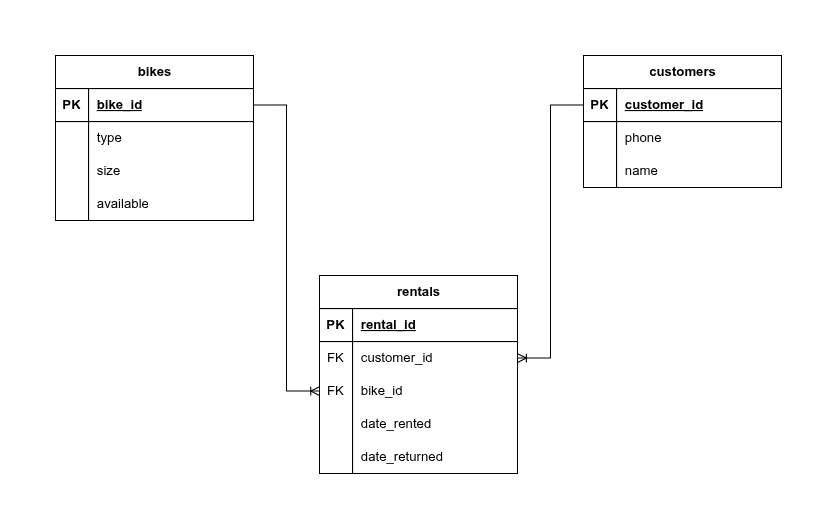

# Bike Rental Shop

A PostgreSQL relational database project providing a simple command-line interface (CLI) for managing bike rentals and returns. This project was completed as part of the freeCodeCamp Relational Database certification curriculum.

## Features

The application allows users (customers) to interact with the system via a shell script to perform the primary functions of a rental shop:

- **View Available Bikes:** Displays a live list of bikes available for rent (type and size).

- **Rent a Bike:** Creates a new customer record if a phone number is not found and also creates a new rental record and updates the bike's availability status.

- **Return a Bike:** Lists the bikes currently rented by a customer (identified by phone number)and updates the rental record with a return date/timestamp and sets the bike's status back to available.

- **Database Design:** Uses a normalized schema to manage bikes, customers, and rentals through foreign key relationships.

## Technologies

- PostgreSQL, SQL, PSQL
- Bash Shell Scripting

## Project Structure

- **bikes.sql**: Contains the DDL(schema) and DML(seed data) for the PostgreSQL database.

- **bike-shop.sh**: bash script file that provides the CLI and runs PSQL commands

## Database Schema

## Demo
[Click here to Watch Demo !](https://youtu.be/gmmCyFcucCs)

## Learnings
This project was a practical exercise in applying core relational database concepts:

- **Database-Driven CLI:** Learning how to successfully connect a shell script environment to a live database using the psql -c command.

- **Data Normalization:** Designing and implementing the schema to avoid redundancy by separating data into bikes, customers, and rentals tables, linked by foreign keys.

- **Transactional Logic:** Implementing the two-step rental and return processes to ensure data integrity, specifically updating two tables (rentals and bikes) for a single customer action.

- **User Input Validation:** Incorporating basic shell script logic to handle invalid inputs (e.g., non-numeric bike IDs) before submitting the query to the database.
