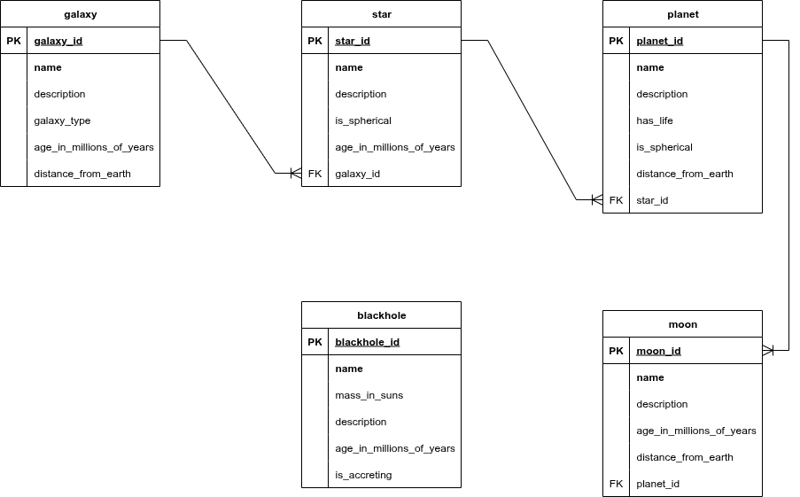

# Celestial Bodies Database

## Description
This project is a relational database designed to store information about a simplified universe, including galaxies, stars, planets, and moons. It was created as part of the freeCodeCamp Relational Database certification, demonstrating skills in data modeling and PostgreSQL.

**Technologies Used:**
* **PostgreSQL**
* **psql**

## Database Schema
Below is the Entity-Relationship (ER) diagram for the database, which illustrates the tables, their columns, and the relationships between them.

