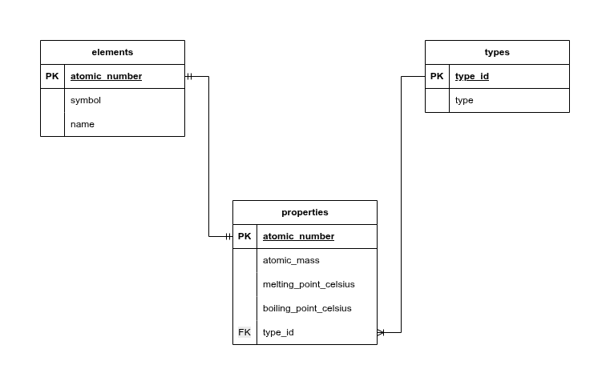

# Periodic Table Database

This project is a command-line interface (CLI) tool built using a PostgreSQL database and a Bash shell script to quickly retrieve information about elements from the periodic table. Users can query the database by an element's atomic number, symbol, or name to get detailed property information, such as atomic mass, melting point, and boiling point.

## Features
- **Flexible Search:** Find elements by providing the atomic number (e.g., 1), the symbol (e.g., He), or the name (e.g., Lithium).

- **Detailed Output:** The script provides a clear, single-sentence summary of the element, including:

    - Atomic Number

    - Name and Symbol

    - Element Type (e.g., nonmetal, metal, metalloid)

    - Atomic Mass

    - Melting and Boiling Points (in Celsius)

- **Input Validation & Error Handling:**

    - Checks if an argument is provided.

    - Informs the user if the requested element is not found in the database.

- **Case Sensitivity Handling:** Automatically capitalizes the first letter of a provided name to match database entries.

## Technologies

- **Bash Shell:** The main scripting language for the CLI tool (element.sh).

- **PostgreSQL:** The relational database system used to store and manage periodic table data.

- **SQL:** Used for defining the database schema and executing queries within the Bash script.

- **Standard Linux Tools:** Utilizes tools like psql, sed, echo, and xargs for database interaction, string manipulation, and formatting.

## Project Structure

- **periodic_table.sql:** SQL dump file containing the database schema (elements, properties, types tables) and initial data insertion.

- **element.sh:** The executable Bash script that handles user input, queries the PostgreSQL database, and formats the output.

## Example Usage

To run the script, make sure it is executable (```chmod +x element.sh```) and use the following syntax:

- ```./element.sh 6``` : Search by Atomic number
- ```./element.sh H``` : Search by Symbol
- ```./element.sh hydrogen``` : Search by Name

## Database Schema


## Learnings

- **Database Interaction in Bash:** Mastering the execution of SQL queries from a Bash script using psql, including handling command-line arguments and integrating results into shell variables.

- **Data Retrieval and Joins:** Constructing complex SQL INNER JOIN queries to link data across normalized tables (elements, properties, types) to retrieve a complete record with a single query.

- **Shell Scripting Logic and Regex:** Utilizing regular expressions (=~) within conditional statements (if/elif/else) to parse and validate user input (atomic number, symbol, or name) and determine the appropriate database search condition.

- **Data Formatting and Cleaning:** Employing tools like IFS (Internal Field Separator) and xargs to safely read and clean delimited data from psql output, ensuring a precise and professional final display.