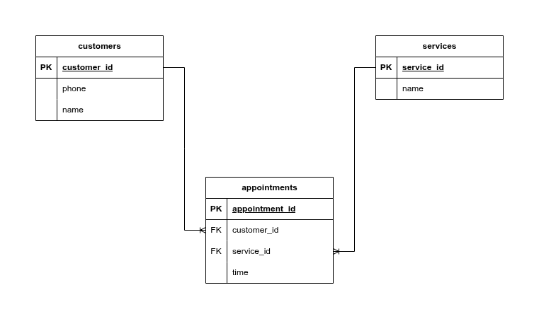

# Salon Appointment Scheduler
A Bash script and PostgreSQL database project simulating a simple appointment booking system for a hair salon.

## Features
The script provides a command-line interface for customers to book services and includes logic for recognizing existing customers.

- **Service Selection:** Displays a numbered list of available services fetched from the database, prompting the user for a selection1.

- **Input Validation:** Re-displays the service menu if an invalid service ID is chosen.

- **Customer Lookup:** Prompts for a phone number and checks if the customer already exists in the customers table.

- **New Customer Registration:** If the phone number is new, the user is prompted for their name, and a new record is created. 

- **Appointment Booking:** Collects the service time and inserts a new appointment record into the appointments table.

- **Confirmation Output:** Provides a success message with the customer's name, service, and time upon successful booking

## Technologies
- **Database:** PostgreSQL
- **Scripting:** Bash
- **Tool:** psql for executing SQL commands within the Bash script

## Project Structure
- ```salon.sh``` : The main Bash script containing the program logic, user interface, and database queries. It handles the full appointment flow.

- ```salon.sql``` : A PostgreSQL database dump file containing all the necessary ```CREATE DATABASE```, ```CREATE TABLE```, and ```INSERT``` commands to rebuild the entire salon database and its initial data.

## Database Schema


## Demo
[Click here to see the Demo video !](https://youtu.be/dXJwGURAkEQ)

## Learnings
This project reinforced practical skills in database scripting and command-line programming:

- **Bash & SQL Integration:** Mastering the use of psql -c "SQL QUERIES" within a Bash script to query and manipulate a PostgreSQL database.

- **Data Flow Management:** Handling user input (```read``` command ) and using variable assignments to pass data between Bash and SQL operations.

- **Conditional Logic in Bash:** Implementing ```if/then/else``` statements to create a robust user flow, such as checking for invalid input and determining if a customer record needs to be created.

- **Database Design:** Applying best practices for schema design, including proper primary keys, foreign keys, and unique constraints for efficiency and data integrity.

- **Database Management:** Understanding how to create a database dump (```pg_dump```) and rebuild a database (```psql < salon.sql```) for project submission and portability.